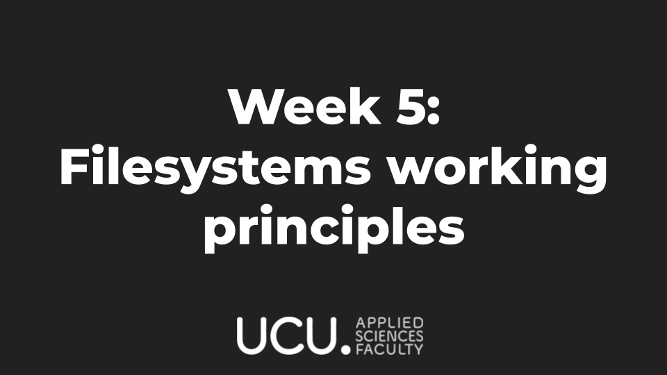
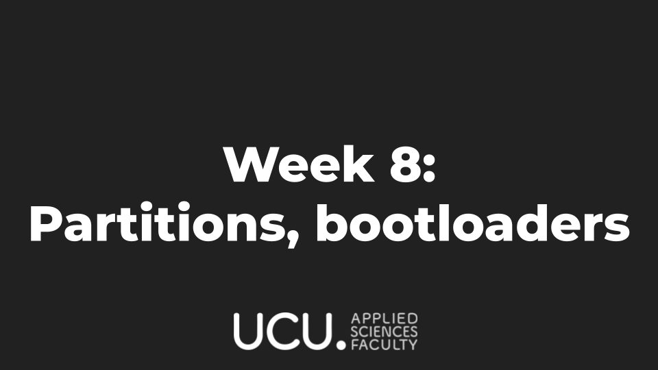

# Linux Club 2021

Official repository of UCU student-organized Linux Club 21/22 with the schedule, useful links and presentations.

**We also have a [website over here](https://ucu-computer-science.github.io/UCU_Linux_Club/)!**

### Pre-requirements:
- Personal laptop.
- [ArchLinux](https://www.archlinux.org/) on your PC (not VM) or other Arch-based systems.
  Can be [Manjaro](https://manjaro.org/downloads/official/gnome/), but NOT Debian- or Fedora-based systems.
    - Manual for Arch Linux installation [here](https://ucu-computer-science.github.io/UCU_Linux_Club/articles/arch-manual/)
    - Manual for Manjaro installation [here](https://ucu-computer-science.github.io/UCU_Linux_Club/articles/manjaro-manual/)
- GNOM3 + Gnome shell or i3, **BUT** not (KDE, XFCE, MATE, Sway etc).
- Basic knowledge of English language
- [GitHub account](https://github.com/).
- USB flash drive 8Gb+
- **Webcams on** during online presentations.
- Desire to learn something new and useful that will assist you throughout your career.

#### For Mac users
If you are going to visit the club regularly, the best is to install Arch/Manjaro natively. If you can't, you are going to need:

- [brew](https://brew.sh) package manager 
  ... More coming soon

### Project structure

* [Useful resources, links and documentation](https://ucu-computer-science.github.io/UCU_Linux_Club/articles/)
* [Week directories with useful resources](./homework/)

### Can be useful before the course:

- Watching the Revolution OS movie: [original version](https://www.youtube.com/watch?v=4vW62KqKJ5A) (which is better) or in [Russian](https://www.youtube.com/watch?v=n1F_MfLRlX0)
- Reading about Linux distros in general [Wiki page on Linux](https://en.wikipedia.org/wiki/Linux), [Wiki page on Linux distributions](https://en.wikipedia.org/wiki/Linux_distribution)

# Schedule

## Week 0

## Week 1

## Week 2

## Week 3

## Week 4

## Week 5

## Week 6

## Week 7

## Week 8

## Week 9

## Week 10

## Week 11

## Next year

A lot more interesting and advanced stuff!

# Usage for students

* Fork this repository
* Watch the lecture
* Work on your homework in the 'homework' directory
* Submit a pull request into your own repository's master
* Add us as contributors into your repository
* Add the responsible person as a reviewer to the pull request
* Done!

# Usage for contributors

* Fork this repository
* Add any content and homework tasks in the 'homework' directory
* Share a link to your presentation (either an Overleaf Latex one,
or a Google Drive presentation in our [collaborative folder](https://drive.google.com/drive/u/1/folders/1sIDCjVzGFoQjZx35y-x2HWAjBaNIDXvk))
* Submit pull requests when you're done working on your stuff!
