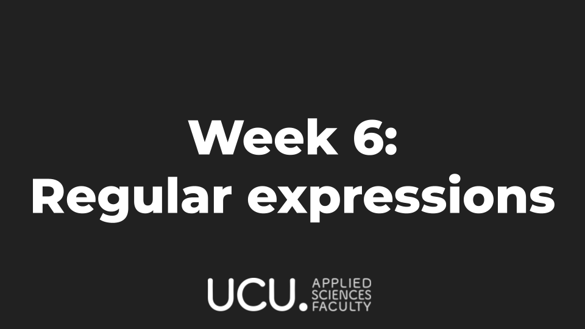
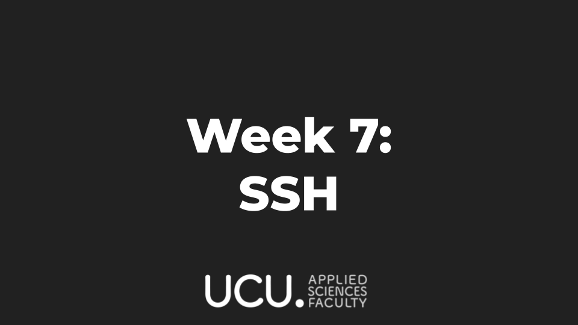

# Linux Club 2021
Official repository of UCU student-organized Linux Club 21/22 with the schedule, useful links and presentations.

### Pre-requirements:
- Personal laptop.
- [ArchLinux](https://www.archlinux.org/) on your PC (not VM) or other Arch-based systems.
  Can be [Manjaro](https://manjaro.org/downloads/official/gnome/), but NOT Debian- or Fedora-based systems.
    - Manual for Arch Linux installation [here](./docs/arch_manual.md)
    - Manual for Manjaro installation [here](./docs/manjaro_manual.md)
- GNOM3 + Gnome shell or i3, **BUT** not (KDE, XFCE, MATE, Sway etc).
- Basic knowledge of English language
- [GitHub account](https://github.com/).
- USB flash drive 8Gb+
- **Webcams on** during online presentations.
- Desire to learn something new and useful that will assist you throughout your career.

#### For Mac users
If you are going to visit the club regularly, the best is to install Arch/Manjaro natively. If you can't, you are going to need:

- [brew](https://brew.sh) package manager</br>
  ... More coming soon

### Project structure

* [Useful resources, links and documentation](./docs/)
* [Week directories with useful resources](./weeks/)

### Can be useful before the course:

- Watching the Revolution OS movie: [original version](https://www.youtube.com/watch?v=4vW62KqKJ5A) (which is better) or in [Russian](https://www.youtube.com/watch?v=n1F_MfLRlX0)
- Reading about Linux distros in general [Wiki page on Linux](https://en.wikipedia.org/wiki/Linux), [Wiki page on Linux distributions](https://en.wikipedia.org/wiki/Linux_distribution)

# Schedule

## Week 0


## Week 1


## Week 2


## Week 3


## Week 4


## Week 5


## Week 6




## Week 7



## Week 8


## Week 9


## Week 10


## Next year

A lot more interesting and advanced stuff!

# Usage for students
```
# Fork this repository
# Watch the lecture
# Work on your homework in the 'homework' directory
# Submit a pull request into your own repository's master
# Add us as contributors into your repository
# Add the responsible person as a reviewer to the pull request
# Done!
```

